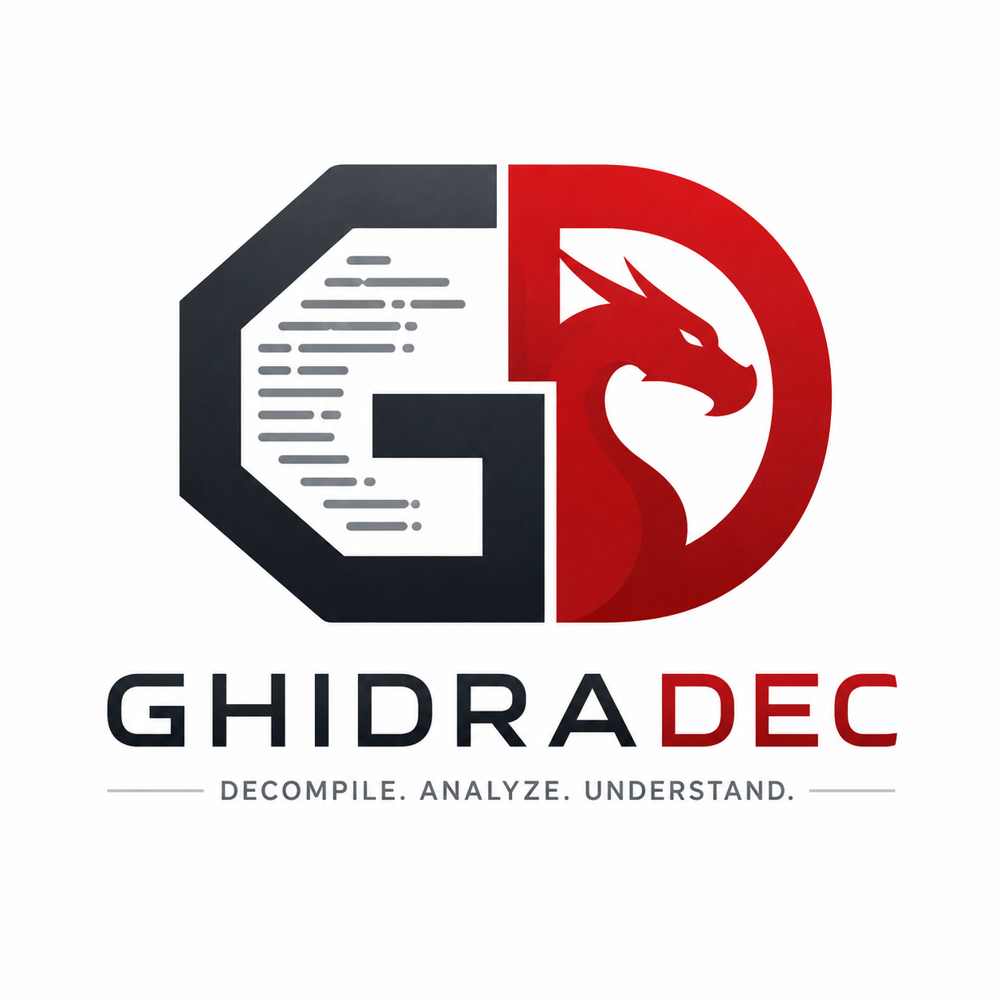

<p align="center">
  
</p>

# GhidraDec: Ghidra Decompiler Plugin for IDA Pro

GhidraDec: Ghidra decompiler plugin for Hex-Rays IDA (Interactive DisAssembler) Pro

The active target is Ghidra 12.1.x. Older Ghidra runtime compatibility is not a primary goal because Ghidra is freely available; IDA SDK compatibility is maintained more carefully because IDA is a licensed product.

The IDA plugin is intended to retain compatibility across supported IDA SDK generations where practical, including current IDA 9.x SDKs.
The plugin does NOT work with the freeware version of IDA 6/7.x.
The plugin comes at both 32-bit and 64-bit address space variants (both are 64-bit binaries). I.e. it works in both `ida` and `ida64`.
It can decompile any processor architecture which Ghidra and IDA both support.  See the source or product information of these tools:
https://github.com/NationalSecurityAgency/ghidra/tree/master/Ghidra/Processors
https://www.hex-rays.com/products/ida/processors.shtml

## Installation and Use

Currently, we officially support only Windows and Linux. It may be possible to build macOS version from the sources, but since I do not have a Mac, I cannot create a pre-built package, or continually make sure the macOS build is not broken.

1. Either download and unpack a pre-built package from the [latest release](https://github.com/GregoryMorse/GhidraDec/releases/latest), or build and install the GhidraDec IDA plugin by yourself (the process is described below).

## Build and Installation

### Requirements

**Note: These are requirements to build the Ghidra IDA plugin, not to run it. See our user guide for information on plugin installation, configuration, and use.**

* A compiler supporting C++14
  * On Windows, only Microsoft Visual C++ is supported (version >= Visual Studio 2015).
* IDA SDK
  * Supported build targets are defined in `ghidradec.targets.json`.
  * IDA SDK 9.2, 9.3, and `latest` are fetched from the public Hex-Rays SDK repository.
  * CI and release builds target IDA SDK 9.3 by default; older SDK packages can be generated on demand from the manual release workflow.
  * Older SDKs remain private and are restored from encrypted archives for CI.
  * EA32 libraries are present through the 8.4 SDK targets; 8.5 and newer are EA64-only.

* Bison, the GNU parser generator, only when regenerating parser outputs.
  * On Windows, [win_flex_bison](https://sourceforge.net/projects/winflexbison/).
  * The generated parser sources are checked in, so normal Visual Studio builds do not require it.

* Ghidra 12.1.x runtime for actually using the plugin.
  * Set `GHIDRA_INSTALL_DIR` to an extracted Ghidra installation when tools need to launch Ghidra.
  * Build support sources are generated under `build/deps/ghidra-decompiler` from the manifest-pinned Ghidra source archive.
  * Set `GHIDRA_DECOMPILER_CPP_DIR` or `GHIDRA_INSTALL_DIR` only when refreshing from a local Ghidra source checkout/install instead of the archive.

* x64dbg snapshot or SDK for the x64dbg plugin.
  * The snapshot's `pluginsdk` folder is enough to build the plugin.
  * The snapshot's `release/<arch>/plugins` folder is used only as a deploy/test destination.

### Configurable local paths

Do not commit machine-specific paths. Use environment variables, MSBuild properties, or CMake cache variables:

* `IDA_SDK_DIR`: IDA SDK for 64-bit address-size builds, for example IDA SDK 9.3.
* `IDA_SDK_DIR32`: older IDA SDK used for 32-bit address-size compatibility builds.
* `IDA_PATH`: optional IDA install root for CMake install.
* `IDA_DEPLOY`: optional Visual Studio post-build deploy root for the IDA plugin.
* `WIN_FLEX_BISON_PATH`: optional path containing `win_bison.exe`.
* `GHIDRA_INSTALL_DIR`: local extracted Ghidra runtime.
* `GHIDRA_DECOMPILER_CPP_DIR`: optional Ghidra decompiler C++ source directory, used with `GHIDRADEC_REFRESH_GHIDRA_SOURCES=ON`.
* `X64DBG_DIR`: local x64dbg snapshot root.
* `X64DBG_SDK_DIR`: x64dbg plugin SDK root. Defaults to `$(X64DBG_DIR)\pluginsdk`.
* `X64DBG_DEPLOY_DIR`: x64dbg plugin deploy folder. Defaults to `$(X64DBG_DIR)\release\$(Platform)\plugins`.
* `GHIDRADEC_X64DBG_PROJECT_DIR`: optional runtime location for Ghidra projects created by the x64dbg plugin.

### Process

* Clone the repository:
  * `git clone https://github.com/GregoryMorse/GhidraDec.git`
* Local manifest-driven build:
  * `cd ghidradec`
  * `python tools/build.py --ida-version 9.3`
  * Use `--ida-version latest` to build against the moving Hex-Rays `ida-sdk` master branch.
* Manual CMake:
  * `python tools/ida_sdk.py ensure --version 9.3`
  * `python tools/deps.py ensure-ghidra-sources`
  * `cmake -S . -B build -DGHIDRADEC_IDA_VERSION=9.3`
  * `cmake --build build --config Release --parallel`
  * `cmake --build build --config Release --target package_plugins`
* Visual Studio:
  * Open `ide/vs/GhidraDec.sln`, or use a CMake-generated solution.

Normally you select an SDK with `-DGHIDRADEC_IDA_VERSION=<version>`. CMake will
look under `.idasdks`, `idasdks`, and the build tree for the manifest-defined SDK
directory. You can still pass `-DIDA_SDK_DIR=<path>` or `-DIDA_SDK_DIR32=<path>`
to override that resolution.

You can pass the following additional parameters to `cmake`:
* `-DIDA_PATH=</path/to/ida>` to tell `cmake` where to install the plugin. If specified, installation will copy plugin binaries into `IDA_PATH/plugins`, and content of `scripts/idc` directory into `IDA_PATH/idc`. If not set, installation step does nothing.
* `-DGHIDRADEC_REFRESH_GHIDRA_SOURCES=ON -DGHIDRA_INSTALL_DIR=<path-to-ghidra>` to refresh the generated Ghidra decompiler support source subset from a local Ghidra install during configure.

### Visual Studio builds

The maintained Visual Studio solution lives under `ide/vs`. `PropertySheet.props`
intentionally avoids committed absolute SDK paths. Set properties in the
environment, on the MSBuild command line, or in a user-local `.props` file:

```
msbuild ide\vs\GhidraDec.vcxproj /p:Configuration=Release /p:Platform=x64 /p:IDA_SDK_DIR=<path-to-idasdk93>
```

All MSVC outputs are redirected under `build/msvc` by `Directory.Build.props`,
including project binaries and intermediate object files. Removing `build/msvc`
is safe when you want a clean Visual Studio build tree.

The x64dbg plugin can be built and deployed with:

```
msbuild GhidraDec-x64dbg\GhidraDec-x64dbg.vcxproj /p:Configuration=Release /p:Platform=x64 /p:X64DBG_DIR=<path-to-x64dbg-snapshot>
```

At runtime, set `GHIDRA_INSTALL_DIR` before launching x64dbg.

### IDA 9.3 smoke test

The old `tests/ida93` harness is kept only as local historical reference. New
corpus-scale testing should use the batch runner described in
`docs/ida-regression-testing.md`. The first supported corpus lane stages pinned
`angr/binaries` samples in x86_64, x86_32, then x86_16 order and runs IDA Pro
9.3 decompile-all in batch mode with dialog automation.

Public GitHub-hosted CI is compile/package-only. IDA-backed regression runs
belong on a licensed self-hosted runner or local release-certification machine.

### IDA Installation and Configuration for Windows
The Windows version of the plugin requires Windows 7 or later, with the MSVC 2015 runtime installed.

1. Download the Windows installation package from the project’s release page.
2. Copy ghidradec.dll and ghidradec64.dll to the IDA’s plugin directory (<IDA_ROOT>/plugins).

### IDA Installation and Configuration for Linux
Follow the next steps to install RetDec plugin in a Linux environment:

1. Install 64-bit versions of the following shared-object dependencies:
libc.so.6 libgcc_s.so.1 libm.so.6 libpthread.so.0 libstdc++.so.6
2. Download the Linux installation package (Table 1) from the project’s release page.
3. Copy retdec.so and retdec64.so to the IDA’s plugin directory (<IDA_ROOT>/plugins).

### Dependency on Ghidra
It requires an extracted Ghidra release archive for the following files:
Ghidra/Processors/**
Ghidra/Features/Decompiler/os/win_x86_64/decompile.exe (on Windows 64)
Ghidra/Features/Decompiler/os/*/decompile (on Linux 64 or Mac 64)

### 3rd Party code listing
The CMake build fetches and pins open-source dependency archives from
`ghidradec.targets.json`:

RetDec v3.3: https://github.com/avast/retdec config and utils libraries:
`ghidradec.targets.json`

jsoncpp library v1.8.4: https://github.com/open-source-parsers/jsoncpp
`ghidradec.targets.json`

The repository carries project code and derives third-party source subsets into
`build/deps`; generated third-party source trees are intentionally not committed
at the repository root.

RetDec IDA Plugin v0.9: https://github.com/avast/retdec-idaplugin
`src/idaplugin/*.cpp;*.h` -> `src/`

whereami library: https://github.com/gpakosz/whereami
Generated dependency source, not committed in the repository root.

Ghidra decompiler and sleigh module: https://github.com/NationalSecurityAgency/ghidra
Generated by `python tools/deps.py ensure-ghidra-sources` into
`build/deps/ghidra-decompiler` from the version pinned in
`ghidradec.targets.json`.

In Ghidra/Features/Decompiler/src/decompile/cpp/ -> generated decompile subset:
Following .hh/.cc/.y files for Sleigh: sleigh pcodeparse pcodecompile sleighbase slghsymbol slghpatexpress slghpattern semantics context filemanage
Following .hh/.cc/.y files for Core: xml space float address pcoderaw translate opcodes globalcontext
Following .hh/.cc files for LibSLA: loadimage memstate emulate opbehavior
Following .hh additional LibSLA files: types.h error.hh partmap.hh

pcodeparse.y and xml.y require bison
For Windows can use and make sure it is in the path: https://sourceforge.net/projects/winflexbison/ (at least win_bison.exe and the data folder)

### IDA’s plugin.cfg

The plugin’s default mode is set to selective decompilation. It tries to register hotkey CTRL+G for its invocation. If you already use this hotkey for another action or you just want to use a different hotkey, you need to modify IDA’s plugin configuration file. Moreover, the plugin supports one more decompilation mode and a hotkey invocation for the plugin’s configuration. If you want to use any of them, you also have to modify the config file. The IDA’s plugin configuration file is in <IDA_ROOT>/plugins/plugins.cfg. Its format is documented inside the file itself. To configure GhidraDec plugin, add the following lines at the beginning of the file:

```
; Plugin_name 						File_name 		Hotkey 		Arg
; -----------------------------------------------------------------
Ghidra_Decompiler 					ghidradec 		Ctrl-g 		 0
Ghidra_Decompiler_All 				ghidradec 		Ctrl-Shift-g 1
Ghidra_Decompiler_Configuration 	ghidradec 		Ctrl-Shift-c 2
```

These lines tell IDA which hotkeys invoke the plugin and what argument is passed to it. The plugin’s behavior after invocation is determined by the passed argument. Possible argument values are summarized in Table 3. In the provided example, we mapped selective decompilation to hotkey CTRL+D (plugin’s default), full decompilation to CTRL+SHIFT+D, and plugin configuration to CTRL+SHIFT+C. However, you may choose whichever hotkeys you like, provided they do not clash with other plugins or IDA.

Description of GhidraDec plugin’s invocation arguments.
Argument value 		Description
0 					Invokes selective decompilation.
1 					Invokes full decompilation.
2 					Invokes plugin configuration inside IDA.

## License

Copyright (c) 2021 Gregory Morse, licensed under the MIT license. See the `LICENSE` file for more details.

GhidraDec IDA plugin uses third-party libraries or other resources listed, along with their licenses, in the `LICENSE-THIRD-PARTY` file.
